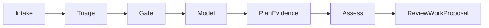

# GitHub Issue Planner Implementation Plan

**Goal:** Turn an accepted `ready-to-plan` GitHub case into a durable plan evidence document and a next Work proposal.

**Architecture:** A bounded planner command reads candidates through the three-condition `PlanningGate`, asks a model for a strict plan document, stores it as evidence, and assesses the triage Work to `CONTINUE` with a `github.issue.plan.review` next Work proposal. The proposal has read authority only. Materializing a Task requires a future executor and routing contract; the planner does not create an eligible Task that a mismatched executor could lease. The latest-revision check runs in the same transaction as the assessment.

## Task 1: Commit-time latest-revision guards

- [x] Add a failing `workflowcase` test for a newer registered revision before `Assess`.
- [x] Add an opt-in latest-revision guard to the assessment transaction, using parsed RFC3339 timestamps. Keep replay of an already committed assessment idempotent.
- [x] Run `GOCACHE=/tmp/summa42-full-go-cache go test ./internal/workflowcase -count=1`.

## Task 2: Strict plan document and model boundary

- [x] Add failing tests for missing fields, extra fields, empty steps, excessive steps, and valid output.
- [x] Define `PlanInput`, `PlanOutput`, `Plan` and canonical evidence encoding in `internal/ghtriage`; extend the CLI model adapter with `Plan`.
- [x] Run `GOCACHE=/tmp/summa42-full-go-cache go test ./internal/ghtriage/... -count=1`.

## Task 3: Planner transition and recovery

- [x] Add failing tests for candidate selection, stored plan evidence, one assessment, one next Work proposal, repeat ticks, and a newer revision race.
- [x] Implement `Planner.Tick` using `PlanningGate` and `Assess` with the latest-revision guard. Use plan evidence as the assessment citation. A model failure leaves the case unchanged for retry.
- [x] Run `GOCACHE=/tmp/summa42-full-go-cache go test ./internal/ghtriage -count=1`.

## Task 4: Reviewer and command

- [x] Add a failing review test showing that a legitimate planning assessment of `ready-to-plan` is not a structural violation.
- [x] Update `stateMatches` in the same code change as the first planner assessment, checking the plan evidence cited by that assessment.
- [x] Add `run-gh-plan` command flags for mission and model, JSON result and per-case failure exit status; add command tests.
- [x] Run `GOCACHE=/tmp/summa42-full-go-cache go test ./cmd/summa42-box ./internal/ghtriage -count=1`.

## Verification

The full test suite passed except the two known baseline `TestLocalExperience*` acceptance failures. `graphify update . --no-cluster` exceeded 45 seconds on the aggregate root graph; the existing graph was not fully refreshed.

- [ ] `GOCACHE=/tmp/summa42-full-go-cache go test ./...` with local sockets available; compare `tests/acceptance` against the known `TestLocalExperience*` baseline.
- [x] `GOCACHE=/tmp/summa42-full-go-cache go vet ./...` and `go build ./...`.
- [ ] Review `git diff --check`, refresh graphify, and report any graph rebuild limitation.
